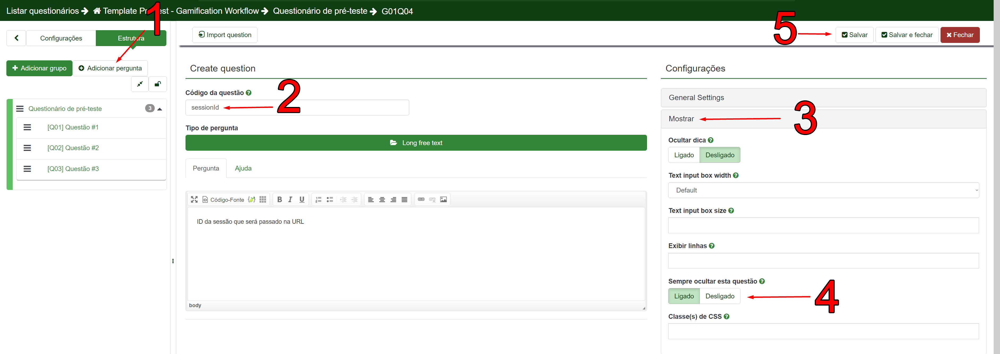
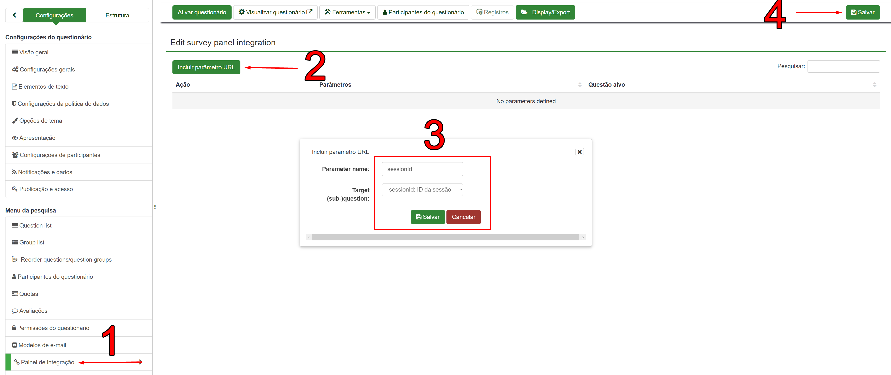

## Como configurar a plataforma

### Configurando os ambientes

##### 1. Arquivo de configuração

Os ambientes da aplicação são definidos no arquivo `config.json`, localizado na pasta `src`.
Este arquivo contém duas variáveis:
* `participantAllocation`
	* Define como os participantes são alocados nos ambientes.
	* Caso seu valor seja `"random"`, os ambientes são alocados aleatoriamente.
	Caso seu valor seja um número inteiro _x_, o ambiente é trocado a cada _x_ participantes.

* `environments`
	* Define quais serão os ambientes da plataforma.
	* Os ambientes podem ser definidos em arquivos separados ou explicitamente nesta área do arquivo de configuração.
	* Todos arquivos de ambientes devem estar na pasta `src/environments`.
	* É obrigatório que haja um ambiente com nome de `default` com todas as variáveis definidas, pois quando tais variáveis não são definidas em outros ambientes o valor usado será o que está em `default`.

* Exemplo de arquivo de configuração:
```js
 {
    "participantAllocation": "random",
    "environments": {
        "stMale": "stMaleConf.json", // arquivo de configuração
        "stFemale": {		// atribuição direta
             "theme": {
                "primary": "blue",
                "secondary": "blue"
              },
             ...
        "default": {}		// atribuição direta
     }
 }
```

##### 2. Configuração do ambiente

Aqui será explicado as variáveis usadas para configurar um ambiente. Caso alguma dessas variáveis não esteja presente no arquivo de configuração, será usado o valor definido no ambiente `default`.
Clique [aqui](/src/environments/template.json) para ver um arquivo de exemplo.

* `localization` [(exemplo)](/src/environments/template.json#L2)
	Aqui são definidas as strings que aparecem no site.
	* `pageTitle` — Título da página
	* `title` — Texto que aparece no cabeçalho da página
	* `points` — Texto na caixa de pontos
	* `rightAnswers` — Texto na caixa de acertos
	* `ranking` — Texto na caixa do ranking
	* `myTrophies` — Texto na caixa de troféus
	* `avatarSelection`
		* `header` — Cabeçalho da área de seleção de avatares
		* `text` — Descrição da área de seleção de avatares
		* `next` — Texto do botão de continuar
	* `wrongAnswer` — Texto que aparece ao errar uma questão
	* `rightAnswer` — Texto que aparece ao acertar uma questão

* `preTest` e `postTest` [(exemplo)](/src/environments/template.json#L21)
	* Link direto para questionários externos de pré e pós-teste.
	* É possível passar parâmetros para os links fornecidos usando a sintaxe `{{param}}`. No momento os parâmetros suportados são:
		* `{{sessionId}}` — É substituído pelo identificador único da sessão do usuário
		* `{{points}}` — É substituído pelo número de pontos que o usuário fez no quiz

* `playSound`
	* Ativa ou desativa o feedback sonoro ao responder questão. Os valores podem ser `true` (para ativar) ou `false` (para desativar).

* `theme` [(exemplo)](/src/environments/template.json#L24)
	* Define o esquema de cores do ambiente.
	* Há apenas dois campos: `primary` e `secondary`. Apenas a paleta de cores fornecida em `primary` é usada, mas isso pode ser modificado no código.
	* Os valores destes campos podem ser nomes de paletas de cores fornecidas pela biblioteca _Material-UI_ ([clique aqui](https://material-ui.com/customization/color/#playground)) ou objetos com códigos de cores ([clique aqui](https://material-ui.com/customization/palette/#providing-the-colors-directly)) (apenas a propriedade `"500"` é obrigatória).

* `ranking` [(exemplo)](/src/environments/template.json#L29)
	* Define o placar do ambiente. Esta variável aceita apenas um array de objetos que devem ter as seguintes propriedades:
	* `name` — Nome do usuário no placar
	* `points` — Número de pontos
	* `avatar` — Link para a imagem do avatar
		* Nos links, o parâmetro `{theme}` é substituido pelo nome do ambiente

* `avatarList` [(exemplo)](/src/environments/template.json#L47)
	* Define a lista de avatares que o usuário pode selecionar antes de entrar no quiz.
	* A lista é um array de strings onde cada string deve ser o link de um avatar. Nos links, o parâmetro `{theme}` é substituido pelo nome do ambiente.

* `questions` [(exemplo)](/src/environments/template.json#L53)
	* Define as perguntas do quiz.
	* Esta variável é um array de objetos que devem ter as seguintes propriedades:
	* `id` — ID da pergunta. Deve ser único para cada pergunta
	* `texto` (opcional) — Conteúdo da pergunta
	* `image` (opcional) — Link da imagem que aparecerá na pergunta
		* Nos links, o parâmetro `{theme}` é substituido pelo nome do ambiente
	* `answers` - Array com as alternativas
	* `rightAnswer` - Resposta correta. Deve ser escrita exatamente como no campo answers

* `trophies` [(exemplo)](/src/environments/template.json#L196)
	* Define os troféus que o usuário pode ganhar.
	* Esta variável é um array de objetos que devem ter as seguintes propriedades:
	* `id` — ID do troféu. Deve ser único para cada troféu
	* `lockedImage` — Link da imagem que aparecerá quando o troféu não estiver liberado
	* `image` — Link da imagem que aparecerá quando o troféu for liberado
		* Nos links, o parâmetro `{theme}` é substituido pelo nome do ambiente
	* `unlockAt`
		Aqui é definido como o troféu será liberado
		* `points` — Quantidade mínima de pontos
		* `correctAnswers` — Número de respostas corretas
		* `question` — Liberado automaticamente ao chegar na pergunta especificada
		* Ao menos um dos requesitos deve ser definido. Os que não forem necessários devem ser `0`

### Integrando com o LimeSurvey

1. Crie uma nova questão (1) e coloque seu código como `sessionId` (2) e a marque como obrigatória na aba de configurações à direta.
2. Vá na aba "Mostrar" (3), deixe a questão oculta (4) e clique em "Salvar" (5)



3. Na aba de configurações do questionario, no lado esquerdo, vá em "Painel de integração" (1) e clique em "Incluir parâmetro URL" (2). Um pop-up irá aparecer, basta escrever `sessionId` no primeiro campo e selecionar a questão que você criou no passo anterior no segundo campo, após isso basta clicar no botão de salvar do popup (3) e da página (4)



4. Na aba de configurações do questionario, vá em "Elementos de texto" (1) e coloque a URL para qual o usuário será destinado após submeter o questionário (2). Deve ser o link para o servidor onde o tutor está instalado seguido de `?sessionId={PASSTHRU:sessionId}` no final da URL. Feito isto, basta clicar em "Salvar" (3).
* Isso só deve ser feito no questionário de pré-teste.


### Configurando o servidor

Por padrão, o servidor roda na porta 8080. Para trocar basta mudar a variável `SERVER_PORT` no arquivo `.env` e o campo `proxy` no arquivo `package.json` (a porta deve ser igual nos dois arquivos).

### Rodando a aplicação

1. Certifique-se que o [Node.js](https://nodejs.org/en/) está instalado (versão minima: v14)
   - Para atualizar a versão do node empregue o `nvm` (guia: [https://heynode.com/tutorial/install-nodejs-locally-nvm/](https://heynode.com/tutorial/install-nodejs-locally-nvm/))
2. Abra a linha de comando no diretório do projeto
3. Instale as dependências: `npm install`
4. Inicie o projeto

   * 4a. Ambiente de desenvolvimento: `npm start`
	    * O ambiente de desenvolvimento sempre roda na porta 3000

    * 4b. Ambiente de produção
	    * O ambiente de produção roda na porta configurada no passo [acima](#configurando-o-servidor).

		```
		npm run build
		npm run server
		```

### Rodando a aplicação com docker

1. Certifique-se que está instalado:
   - Docker [https://www.docker.com/products/docker-desktop](https://www.docker.com/products/docker-desktop)
   - Docker Compose [https://docs.docker.com/compose/install/](https://docs.docker.com/compose/install/)
   - GIT [https://git-scm.com/downloads](https://git-scm.com/downloads)
2. Abra a linha de comando no diretório do projeto e compile a imagem do docker

   ```
   docker-compose build --no-cache
   ```

3. Executar a aplicação em um container do Docker

   ```
   docker-compose up
   ```

   Para executar a aplicação

   ```
   docker-compose up
   ```

   Para detener a executar da aplicação (use **Ctrl+c** ou feche o terminal)

4. Para executar a aplicação em um container do Docker no segundo plano (in the background)

	```
	docker-compose up -d
	```

   Para detener a executar da aplicação

	```
	docker-compose down
	```

5. Deseja mudar a porta (`port`) da aplicação o alguma configuração da execução da aplicação mude o arquivo `docker-compose.yml` ([mais info...](https://docs.docker.com/compose/compose-file/compose-file-v3/))


### Frameworks utilizados

* React
	* [Documentação](https://reactjs.org/docs/getting-started.html)
* Material-UI
	* [Documentação](https://material-ui.com/getting-started/learn/)
* Express.js
	* [Documentação](https://expressjs.com/en/4x/api.html)
